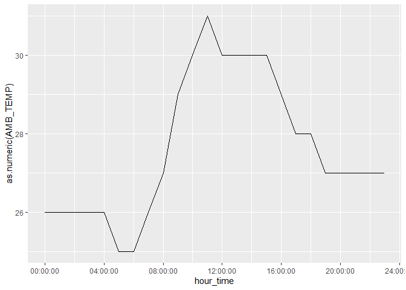
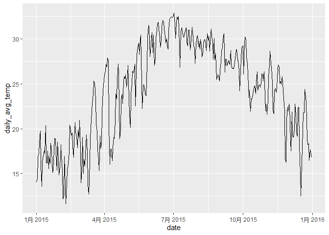
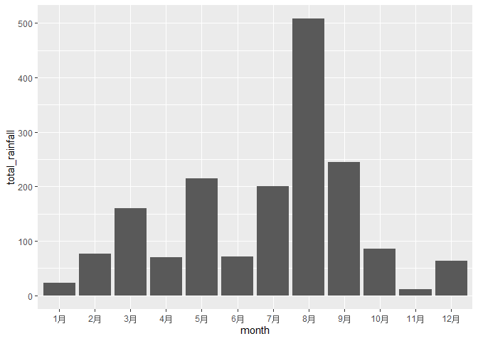
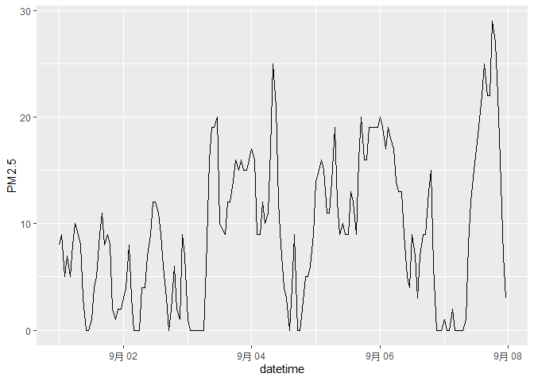

# assignment6


``` r
library(tidyverse)
```

    ── Attaching core tidyverse packages ──────────────────────── tidyverse 2.0.0 ──
    ✔ dplyr     1.1.4     ✔ readr     2.1.5
    ✔ forcats   1.0.0     ✔ stringr   1.5.1
    ✔ ggplot2   4.0.0     ✔ tibble    3.3.0
    ✔ lubridate 1.9.4     ✔ tidyr     1.3.1
    ✔ purrr     1.1.0     
    ── Conflicts ────────────────────────────────────────── tidyverse_conflicts() ──
    ✖ dplyr::filter() masks stats::filter()
    ✖ dplyr::lag()    masks stats::lag()
    ℹ Use the conflicted package (<http://conflicted.r-lib.org/>) to force all conflicts to become errors

``` r
library(knitr)
library(ggplot2)
```

## **Exercise 1. Tibble and Data Import**

#### 1.1

``` r
tribble(
  ~a, ~b, ~c,
  #--|--|----
  1, 2.1, "apple",
  2, 3.2, "orange"
)
```

    # A tibble: 2 × 3
          a     b c     
      <dbl> <dbl> <chr> 
    1     1   2.1 apple 
    2     2   3.2 orange

``` r
tibble(
  a = c(1L, 2L),
  b = c(2.1, 3.2),
  c = c("apple", "orange")
)
```

    # A tibble: 2 × 3
          a     b c     
      <int> <dbl> <chr> 
    1     1   2.1 apple 
    2     2   3.2 orange

#### **1.2 Import `https://raw.githubusercontent.com/nt246/NTRES-6100-data-science/master/datasets/dataset2.txt` into R. Change the column names into “Name”, “Weight”, “Price”**

``` r
dataset2 <- read.table(
  "https://raw.githubusercontent.com/nt246/NTRES-6100-data-science/master/datasets/dataset2.txt",
  header = FALSE,
  sep=","
)

colnames(dataset2) <- c("Name", "Weight", "Price")
dataset2
```

        Name Weight Price
    1  apple      1   2.9
    2 orange      2   4.9
    3 durian     10  19.9

#### **1.3 Import `https://raw.githubusercontent.com/nt246/NTRES-6100-data-science/master/datasets/dataset3.txt` into R. Watch out for the first few lines, missing values, separators, quotation marks, and deliminaters.**

``` r
dataset3<-read_lines("https://raw.githubusercontent.com/nt246/NTRES-6100-data-science/master/datasets/dataset3.txt"
  )
#View(dataset3)

dataset3_tidy<-dataset3 |> 
  keep(~ grepl(";", .x)) |>
   discard(~ grepl("Name", .x, ignore.case = TRUE)) |>
  tibble(line = _) |> 
  separate(line, into = c("Name", "Weight", "Price"), sep = ";") |> 
  mutate(
    Name = gsub("/", "", Name),
    Weight = na_if(Weight, "?"),
    Price = na_if(Price, "Not Available"),
    Weight = as.numeric(Weight),
    Price = as.numeric(Price))
dataset3_tidy
```

    # A tibble: 3 × 3
      Name   Weight Price
      <chr>   <dbl> <dbl>
    1 apple       1   2.9
    2 orange      2  NA  
    3 durian     NA  19.9

## **Exercise 2. Weather station**

#### **2.1 Variable descriptions**

``` r
air<-read_delim("https://raw.githubusercontent.com/nt246/NTRES-6100-data-science/master/datasets/2015y_Weather_Station_notes.txt",delim="-")
```

    Rows: 15 Columns: 3
    ── Column specification ────────────────────────────────────────────────────────
    Delimiter: "-"
    chr (3): Item, Unit, Description

    ℹ Use `spec()` to retrieve the full column specification for this data.
    ℹ Specify the column types or set `show_col_types = FALSE` to quiet this message.

``` r
air
```

    # A tibble: 15 × 3
       Item       Unit    Description                                              
       <chr>      <chr>   <chr>                                                    
     1 AMB_TEMP   Celsius Ambient air temperature                                  
     2 CO         ppm     Carbon monoxide                                          
     3 NO         ppb     Nitric oxide                                             
     4 NO2        ppb     Nitrogen dioxide                                         
     5 NOx        ppb     Nitrogen oxides                                          
     6 O3         ppb     Ozone                                                    
     7 PM10       μg/m3   Particulate matter with a diameter between 2.5 and 10 μm 
     8 PM2.5      μg/m3   Particulate matter with a diameter of 2.5 μm or less     
     9 RAINFALL   mm      Rainfall                                                 
    10 RH         %       Relative humidity                                        
    11 SO2        ppb     Sulfur dioxide                                           
    12 WD_HR      degress Wind direction (The average of hour)                     
    13 WIND_DIREC degress Wind direction (The average of last ten minutes per hour)
    14 WIND_SPEED m/sec   Wind speed (The average of last ten minutes per hour)    
    15 WS_HR      m/sec   Wind speed (The average of hour)                         

#### **2.2 Data tidying**

``` r
weather_sta<-read.csv("https://raw.githubusercontent.com/nt246/NTRES-6100-data-science/master/datasets/2015y_Weather_Station.csv")
#names(weather)
weather_sta_tidy<-weather_sta |> pivot_longer(
    cols = 'X00':'X23',             
    names_to = "hour",            
    values_to = "value" 
) |>
  pivot_wider(
    names_from = item,            
    values_from = value
  ) |> 
  mutate(
    RAINFALL = str_replace(RAINFALL, "NR", "0"),
    across(
    everything(),
    ~ case_when(
        .x %in% c("NR", "#", "*", "x") ~ NA_character_,
        TRUE ~ .x
      )),
    date = ymd(date),
     hour = str_remove(hour, "^X"),
    hour = sprintf("%02d:00", as.integer(hour))
  )
weather_sta_tidy |> 
  select(1:10) |> 
  head(6)
```

    # A tibble: 6 × 10
      date       station hour  AMB_TEMP CO    NO    NO2   NOx   O3    PM10 
      <date>     <chr>   <chr> <chr>    <chr> <chr> <chr> <chr> <chr> <chr>
    1 2015-01-01 Cailiao 00:00 16       0.74  1     15    16    35    171  
    2 2015-01-01 Cailiao 01:00 16       0.7   0.8   13    14    36    174  
    3 2015-01-01 Cailiao 02:00 15       0.66  1.1   13    14    35    160  
    4 2015-01-01 Cailiao 03:00 15       0.61  1.7   12    13    34    142  
    5 2015-01-01 Cailiao 04:00 15       0.51  2     11    13    34    123  
    6 2015-01-01 Cailiao 05:00 14       0.51  1.7   13    15    32    110  

#### **2.3 Using this cleaned dataset, plot the daily variation in ambient temperature on September 25, 2015, as shown below.**

``` r
weather_sta_tidy |> 
  filter(date == ymd("2015-09-25")) |>
  mutate(
    hour_time = hms::parse_hm(hour)
  ) |> 
  ggplot(aes(x = hour_time, y = as.numeric(AMB_TEMP)))+
  geom_line()+
  scale_x_time(
    breaks = hms::parse_hm(sprintf("%02d:00", seq(0, 24, 4)))
  )
```



#### **2.4 Plot the daily average ambient temperature throughout the year with a continuous line, as shown below.**

``` r
weather_sta_tidy |>
  mutate(AMB_TEMP = as.numeric(AMB_TEMP)) |>        
  group_by(date) |>
  summarise(daily_avg_temp = mean(AMB_TEMP, na.rm = TRUE)) |> 
  ggplot(aes(x = date, y = daily_avg_temp)) +
  geom_line()
```

    Warning: There was 1 warning in `mutate()`.
    ℹ In argument: `AMB_TEMP = as.numeric(AMB_TEMP)`.
    Caused by warning:
    ! 强制改变过程中产生了NA



#### **2.5 Plot the total rainfall per month in a bar chart, as shown below.**

``` r
weather_sta_tidy |>
  mutate(
    RAINFALL = as.numeric(RAINFALL),
    year = year(date),
    month = month(date, label = TRUE, abbr = TRUE)
  ) |>
  group_by(year, month) |>
  summarise(total_rainfall = sum(RAINFALL, na.rm = TRUE), .groups = "drop") |>
  ggplot(aes(x = month, y = total_rainfall)) +
  geom_col()
```

    Warning: There was 1 warning in `mutate()`.
    ℹ In argument: `RAINFALL = as.numeric(RAINFALL)`.
    Caused by warning:
    ! 强制改变过程中产生了NA



#### **2.6 Plot the per hour variation in PM2.5 in the first week of September with a continuous line, as shown below.**

``` r
weather_sta_tidy |>
  mutate(
    PM2.5 = stringr::str_replace_all(PM2.5, "[*#x]", ""), 
    PM2.5 = as.numeric(PM2.5), 
    hour = as.numeric(substr(hour, 1, 2))
  ) |>
  filter(!is.na(PM2.5)) |> 
  mutate(
    datetime = make_datetime(
      year = year(date),
      month = month(date),
      day = day(date),
      hour = hour        
  )) |>
  filter(datetime >= ymd("2015-09-01"),
         datetime < ymd("2015-09-08")) |>       
  ggplot(aes(x = datetime, y = PM2.5)) +
  geom_line()
```


