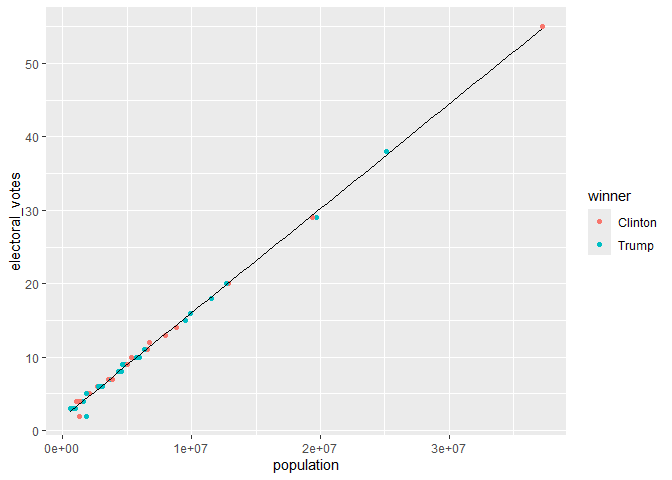
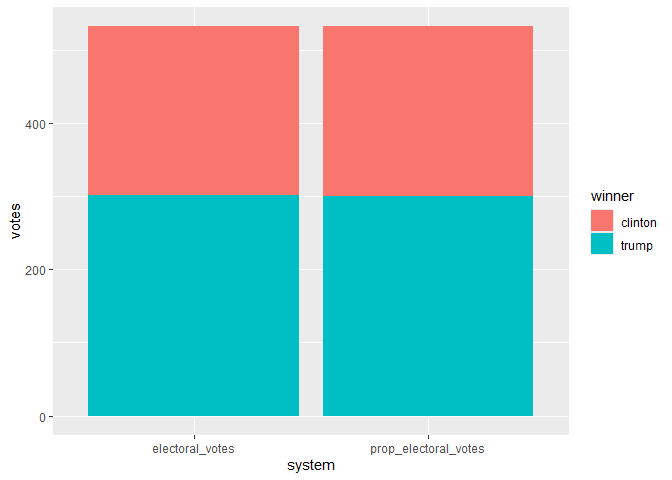
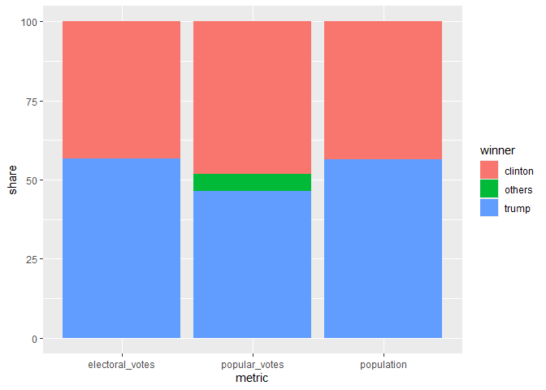
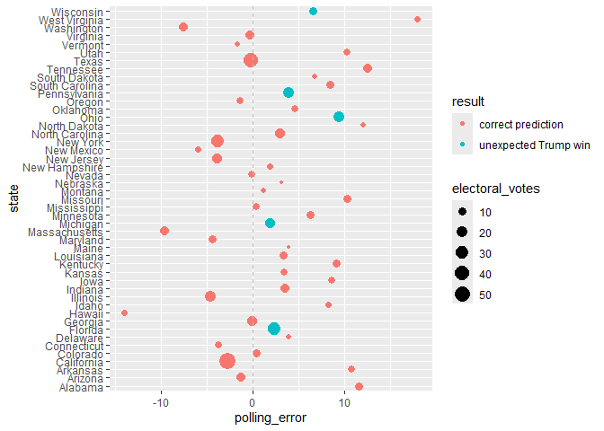

# assignment_7


``` r
library(tidyverse)
```

    ── Attaching core tidyverse packages ──────────────────────── tidyverse 2.0.0 ──
    ✔ dplyr     1.1.4     ✔ readr     2.1.5
    ✔ forcats   1.0.0     ✔ stringr   1.5.1
    ✔ ggplot2   4.0.0     ✔ tibble    3.3.0
    ✔ lubridate 1.9.4     ✔ tidyr     1.3.1
    ✔ purrr     1.1.0     
    ── Conflicts ────────────────────────────────────────── tidyverse_conflicts() ──
    ✖ dplyr::filter() masks stats::filter()
    ✖ dplyr::lag()    masks stats::lag()
    ℹ Use the conflicted package (<http://conflicted.r-lib.org/>) to force all conflicts to become errors

``` r
library(knitr)
#install.packages("dslabs")
library(dslabs)
```

## **Excercise: 2016 election result and polling**

``` r
View(results_us_election_2016)
View(polls_us_election_2016)
View(murders)
```

### **Question 1. What is the relationship between the population size and the number of electoral votes each state has?**

#### 1a.

``` r
q_1a <- left_join(murders, results_us_election_2016, by = "state")
head(q_1a)
```

           state abb region population total electoral_votes  clinton    trump
    1    Alabama  AL  South    4779736   135               9 34.35795 62.08309
    2     Alaska  AK   West     710231    19               3 36.55087 51.28151
    3    Arizona  AZ   West    6392017   232              11 44.58042 48.08314
    4   Arkansas  AR  South    2915918    93               6 33.65190 60.57191
    5 California  CA   West   37253956  1257              55 61.72640 31.61711
    6   Colorado  CO   West    5029196    65               9 48.15651 43.25098
       johnson     stein  mcmullin    others
    1 2.094169 0.4422682 0.0000000 1.0225246
    2 5.877128 1.8000176 0.0000000 4.4904710
    3 4.082188 1.3185997 0.6699155 1.2657329
    4 2.648769 0.8378174 1.1653206 1.1242832
    5 3.374092 1.9649200 0.2792070 1.0382753
    6 5.183748 1.3825031 1.0400874 0.9861714

1b

``` r
q_1b <- q_1a  |> 
  mutate(winner = ifelse(clinton > trump, "Clinton", "Trump"))  |> 
  select(-abb, -region, -total)
head(q_1b)
```

           state population electoral_votes  clinton    trump  johnson     stein
    1    Alabama    4779736               9 34.35795 62.08309 2.094169 0.4422682
    2     Alaska     710231               3 36.55087 51.28151 5.877128 1.8000176
    3    Arizona    6392017              11 44.58042 48.08314 4.082188 1.3185997
    4   Arkansas    2915918               6 33.65190 60.57191 2.648769 0.8378174
    5 California   37253956              55 61.72640 31.61711 3.374092 1.9649200
    6   Colorado    5029196               9 48.15651 43.25098 5.183748 1.3825031
       mcmullin    others  winner
    1 0.0000000 1.0225246   Trump
    2 0.0000000 4.4904710   Trump
    3 0.6699155 1.2657329   Trump
    4 1.1653206 1.1242832   Trump
    5 0.2792070 1.0382753 Clinton
    6 1.0400874 0.9861714 Clinton

1c

``` r
q_1b |> 
  ggplot(aes(x = population, y = electoral_votes, color = winner)) +
  geom_point() +
  geom_smooth(method = "lm", se = FALSE, color = "black", size = 0.1)
```

    Warning: Using `size` aesthetic for lines was deprecated in ggplot2 3.4.0.
    ℹ Please use `linewidth` instead.

    `geom_smooth()` using formula = 'y ~ x'



### **Question 2. Would the election result be any different if the number of electoral votes is exactly proportional to a state’s population size?**

2a.

``` r
q_2a <- q_1b  |> 
  pivot_longer(
    cols = c(population, electoral_votes),
    names_to = "variable",
    values_to = "value"
  )
head(q_2a)
```

    # A tibble: 6 × 10
      state   clinton trump johnson stein mcmullin others winner variable      value
      <chr>     <dbl> <dbl>   <dbl> <dbl>    <dbl>  <dbl> <chr>  <chr>         <dbl>
    1 Alabama    34.4  62.1    2.09 0.442    0       1.02 Trump  population   4.78e6
    2 Alabama    34.4  62.1    2.09 0.442    0       1.02 Trump  electoral_v… 9   e0
    3 Alaska     36.6  51.3    5.88 1.80     0       4.49 Trump  population   7.10e5
    4 Alaska     36.6  51.3    5.88 1.80     0       4.49 Trump  electoral_v… 3   e0
    5 Arizona    44.6  48.1    4.08 1.32     0.670   1.27 Trump  population   6.39e6
    6 Arizona    44.6  48.1    4.08 1.32     0.670   1.27 Trump  electoral_v… 1.1 e1

2b.

``` r
q_2b <- q_1b  |> 
  group_by(winner)  |> 
  summarise(
    electoral_votes = sum(electoral_votes),
    population = sum(population)
  )  |> 
  pivot_longer(cols = c(electoral_votes, population),
               names_to = "metric",
               values_to = "value")  |> 
  mutate(winner = tolower(winner))  |> 
  select(metric, winner, value)
q_2b
```

    # A tibble: 4 × 3
      metric          winner      value
      <chr>           <chr>       <dbl>
    1 electoral_votes clinton       231
    2 population      clinton 134982448
    3 electoral_votes trump         302
    4 population      trump   174881780

2c.

``` r
total_ev <- sum(q_1b$electoral_votes)
q_2b_prop <- q_2b  |> 
  pivot_wider(names_from = metric, values_from = value)  |> 
  mutate(prop_electoral_votes = population / sum(population) * total_ev)  |> 
  select(winner, electoral_votes, prop_electoral_votes)  |> 
  pivot_longer(cols = c(electoral_votes, prop_electoral_votes),
               names_to = "system",
               values_to = "votes") 

# Plot
ggplot(q_2b_prop, aes(x = system, y = votes, fill = winner)) +
  geom_bar(stat = "identity")
```



### **Question 3. What if the election was determined by popular votes?**

3a.

``` r
election_results <- read_csv("https://raw.githubusercontent.com/kshaffer/election2016/master/2016ElectionResultsByState.csv")
```

    Rows: 51 Columns: 11
    ── Column specification ────────────────────────────────────────────────────────
    Delimiter: ","
    chr (2): state, postal
    dbl (9): clintonVotes, clintonElectors, trumpVotes, trumpElectors, johnsonVo...

    ℹ Use `spec()` to retrieve the full column specification for this data.
    ℹ Specify the column types or set `show_col_types = FALSE` to quiet this message.

``` r
q_3a <- election_results  |> 
  select(state, clintonVotes, trumpVotes, johnsonVotes, steinVotes, mcmullinVotes, othersVotes)  |> 
  pivot_longer(
    cols = -state,
    names_to = "winner",
    values_to = "votes"
  )  |> 
  mutate(winner = case_when(
    winner == "clintonVotes" ~ "clinton",
    winner == "trumpVotes" ~ "trump",
    TRUE ~ "others"
  )) |> 
  group_by(winner)  |> 
  summarise(value = sum(votes, na.rm = TRUE))
q_3a
```

    # A tibble: 3 × 2
      winner     value
      <chr>      <dbl>
    1 clinton 65125640
    2 others   7054974
    3 trump   62616675

3b.

``` r
q_3a_add<-q_3a |> mutate(
metric = "popular_votes")
q_3b <- bind_rows(q_2b, q_3a_add)
q_3b
```

    # A tibble: 7 × 3
      metric          winner      value
      <chr>           <chr>       <dbl>
    1 electoral_votes clinton       231
    2 population      clinton 134982448
    3 electoral_votes trump         302
    4 population      trump   174881780
    5 popular_votes   clinton  65125640
    6 popular_votes   others    7054974
    7 popular_votes   trump    62616675

3c.

``` r
calculate_share <- function(data, scenario_metric) {
  scenario_data <- data |> 
    filter(metric == scenario_metric)  |> 
    mutate(total_value = sum(value))  |> 
    mutate(share = (value / total_value) * 100)  |> 
    
    select(metric,winner, share)
  
  return(scenario_data)
}

share_electoral <- calculate_share(q_3b, "electoral_votes")
share_proportional <- calculate_share(q_3b, "population")
share_popular <- calculate_share(q_3b, "popular_votes")

final_data <- bind_rows(share_electoral, share_proportional, share_popular)

final_data |> ggplot(aes(x = metric, y = share, fill = winner)) +
  geom_bar(stat = "identity", position = "stack")
```



### **Question 4. The election result in 2016 came as a huge surprise to many people, especially given that most polls predicted Clinton would win before the election. Where did the polls get wrong?**

4a.

``` r
q_4a <- polls_us_election_2016  |> 
  filter(pollster == "Ipsos",
         state != "U.S.") |> 
  group_by(state) |> 
  slice_max(order_by = enddate, n = 1, with_ties = FALSE) |> 
  select(state, adjpoll_clinton, adjpoll_trump) 
head(q_4a)
```

    # A tibble: 6 × 3
    # Groups:   state [6]
      state       adjpoll_clinton adjpoll_trump
      <fct>                 <dbl>         <dbl>
    1 Alabama                37.5          53.7
    2 Arizona                41.4          46.2
    3 Arkansas               37.2          53.3
    4 California             58.3          31.0
    5 Colorado               46.0          40.7
    6 Connecticut            48.8          38.9

4b.

``` r
q_4b <- q_4a |> 
  left_join(q_1b, by = "state") |> 
  mutate(polling_margin = adjpoll_clinton - adjpoll_trump) |> 
  mutate(actual_margin = clinton - trump) |> mutate(polling_error = polling_margin - actual_margin) |> 
  mutate(predicted_winner = case_when(
    adjpoll_clinton > adjpoll_trump ~ "Clinton",
    adjpoll_trump > adjpoll_clinton ~ "Trump"
  )) |> 
  mutate(result = ifelse(winner == predicted_winner, 
                         "correct prediction", 
                         str_c("unexpected ", winner, " win"))) |> 
  select(state, polling_error, result, electoral_votes)
head(q_4b)
```

    # A tibble: 6 × 4
    # Groups:   state [6]
      state       polling_error result             electoral_votes
      <chr>               <dbl> <chr>                        <dbl>
    1 Alabama            11.6   correct prediction               9
    2 Arizona            -1.32  correct prediction              11
    3 Arkansas           10.8   correct prediction               6
    4 California         -2.78  correct prediction              55
    5 Colorado            0.366 correct prediction               9
    6 Connecticut        -3.69  correct prediction               7

4c.

``` r
q_4b |> 
  mutate(state = reorder(state, polling_error)) |> 
  ggplot(aes(x = state, y = polling_error)) +
  geom_point(aes(size = electoral_votes, color = result)) +
  geom_hline(yintercept = 0, linetype = "dashed", color = "grey") +
  coord_flip()
```


