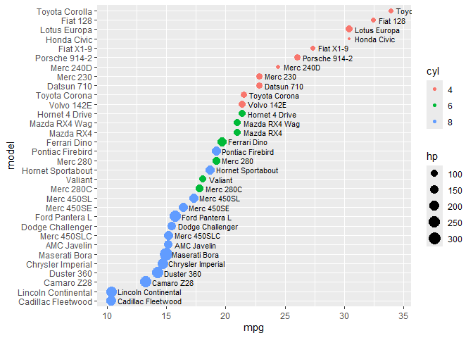

# assignment_9


``` r
library(tidyverse)
```

    ── Attaching core tidyverse packages ──────────────────────── tidyverse 2.0.0 ──
    ✔ dplyr     1.1.4     ✔ readr     2.1.5
    ✔ forcats   1.0.0     ✔ stringr   1.5.1
    ✔ ggplot2   4.0.0     ✔ tibble    3.3.0
    ✔ lubridate 1.9.4     ✔ tidyr     1.3.1
    ✔ purrr     1.1.0     
    ── Conflicts ────────────────────────────────────────── tidyverse_conflicts() ──
    ✖ dplyr::filter() masks stats::filter()
    ✖ dplyr::lag()    masks stats::lag()
    ℹ Use the conflicted package (<http://conflicted.r-lib.org/>) to force all conflicts to become errors

``` r
library(knitr)
```

### Exercise 1: Unit converter

#### 1.1 Write a function that can convert Fahrenheit to Celsius, based on the following fomula: C = (F - 32) \* 5 / 9

``` r
f_to_c<-function(f_temp){
  c_temp=(f_temp - 32) * 5 / 9
  print(c_temp)
}
f_to_c(50)
```

    [1] 10

``` r
f_to_c(212)
```

    [1] 100

**1.2** A student came from ‘tropical Canada’. She doesn’t like the cold
but she really didn’t like it when it’s hot. Although she wanted to know
what the temperature is in Celsius when the US weather channel reported
it in Fahrenheit, there are certain points at which it was just too cold
or too hot for to to care about the exact value. **Modify the f_to_c
function below to print the following**, and check if your function
works properly using the input of **-10 F, 60 F, and 90 F**.

``` r
f_to_c_message <- function(temp_f) {
  temp_c <- (temp_f - 32) * 5 / 9
  

  if (temp_c < -20) {
    print("Don't bother going out.")
  } else if (temp_c > 30) {
    print("I'm moving back to Canada.")
  } else {
    print(paste("The temperature is", round(temp_c, 2), "C"))
  }
}

f_to_c_message(-10)
```

    [1] "Don't bother going out."

``` r
f_to_c_message(60)
```

    [1] "The temperature is 15.56 C"

``` r
f_to_c_message(90)
```

    [1] "I'm moving back to Canada."

## **Exercise 2: Set operation**

``` r
x <- c("prince", "mj", "sam cook", "whitney", "dolly")
y <- c("sharon jones", "prince", "bowie", "leonard cohen", "phife dawg")
setdiff(x,y)
```

    [1] "mj"       "sam cook" "whitney"  "dolly"   

``` r
unique_element <- function(x, y) {
  result <- c(setdiff(x, y), setdiff(y, x))
  return(result)
}

unique_element(x,y)
```

    [1] "mj"            "sam cook"      "whitney"       "dolly"        
    [5] "sharon jones"  "bowie"         "leonard cohen" "phife dawg"   

## **Exercise 3: Fuel Efficiency of Car Models**

``` r
mtcars_tbl <- as_tibble(mtcars, rownames = "model")
mtcars_tbl %>%
  head() %>%
  kable()
```

| model             |  mpg | cyl | disp |  hp | drat |    wt |  qsec |  vs |  am | gear | carb |
|:------------------|-----:|----:|-----:|----:|-----:|------:|------:|----:|----:|-----:|-----:|
| Mazda RX4         | 21.0 |   6 |  160 | 110 | 3.90 | 2.620 | 16.46 |   0 |   1 |    4 |    4 |
| Mazda RX4 Wag     | 21.0 |   6 |  160 | 110 | 3.90 | 2.875 | 17.02 |   0 |   1 |    4 |    4 |
| Datsun 710        | 22.8 |   4 |  108 |  93 | 3.85 | 2.320 | 18.61 |   1 |   1 |    4 |    1 |
| Hornet 4 Drive    | 21.4 |   6 |  258 | 110 | 3.08 | 3.215 | 19.44 |   1 |   0 |    3 |    1 |
| Hornet Sportabout | 18.7 |   8 |  360 | 175 | 3.15 | 3.440 | 17.02 |   0 |   0 |    3 |    2 |
| Valiant           | 18.1 |   6 |  225 | 105 | 2.76 | 3.460 | 20.22 |   1 |   0 |    3 |    1 |

``` r
mtcars_tbl |>
  mutate(
    cyl = factor(cyl),
    model = fct_reorder(model, mpg)
  ) |>
  ggplot(aes(x = mpg, y = model)) +
  geom_point(aes(size = hp, color = cyl)) +
  geom_text(aes(label = model), hjust = 0, nudge_x = 0.5, size = 3) 
```



#### **In this assignment, you wrote functions that operate on vectors (Exercises 1 and 2) and manipulated a data frame to create a plot (Exercise 3). Explain the difference between a simple character vector (like the one for singers) and a factor (like the model column). Why was it necessary to treat the model column as a factor and reorder its levels to create the final plot?**

A character vector has no sequence and hierarchical structure and only
store text data.

A factor has levels and sequence. Data stores as integer.

Why: If we don’t use factor, the car types will arrange in alphabetical
order not mpg order, leading to a messy plot.

#### **Identify one of the three exercises where you used an AI assistant to help generate or debug a chunk of code. Provide the specific prompt you used. Then, show the code before you finalized it (e.g., the AI’s initial suggestion or your first attempt) and the final, working code. In your commentary, explain what was missing or incorrect in the “before” version and what you learned by testing and correcting it to produce the final version.**

In exercise 2, the prompt I use: Give me the answer of this question in
R. Then I paste the question in assignments.

The first chunk of code it gave:

``` r
unique_element <- function(vec1, vec2) {
  only_in_vec1 <- setdiff(vec1, vec2)
  only_in_vec2 <- setdiff(vec2, vec1)
  return(c(only_in_vec1, only_in_vec2))
}
result <- unique_element

print("Vector x (High Voices):")
```

    [1] "Vector x (High Voices):"

``` r
print(x)
```

    [1] "prince"   "mj"       "sam cook" "whitney"  "dolly"   

``` r
print("Vector y (Died in 2016):")
```

    [1] "Vector y (Died in 2016):"

``` r
print(y)
```

    [1] "sharon jones"  "prince"        "bowie"         "leonard cohen"
    [5] "phife dawg"   

``` r
print("---")
```

    [1] "---"

``` r
print("Names of singers who either have high voices but did not die in 2016, OR who died in 2016 but do not have high voices (Symmetric Difference):")
```

    [1] "Names of singers who either have high voices but did not die in 2016, OR who died in 2016 but do not have high voices (Symmetric Difference):"

``` r
print(result)
```

    function (vec1, vec2) 
    {
        only_in_vec1 <- setdiff(vec1, vec2)
        only_in_vec2 <- setdiff(vec2, vec1)
        return(c(only_in_vec1, only_in_vec2))
    }

The code makes sense but there are many unnecessary output. And AI’s
code uses new variable to take the place of x,y, which is more clear.
